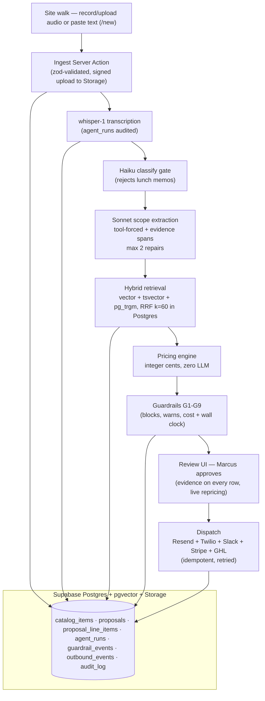

# Greenscape Pro — site-walk proposal agent

An AI agent that turns a contractor's spoken site-walk notes into a priced, reviewable
proposal — built for Greenscape Pro, a $4.2M hardscape design-build company in Phoenix.

## The problem

By the time a homeowner has finished walking their backyard with a contractor, the job
is essentially sold — and then it sits. The contractor drives home with a phone full of
voice memos and a notepad, and turning that into a priced, professional proposal takes
**6 to 9 days** of evenings: transcription, catalog lookups, arithmetic, formatting,
second-guessing the margin. Greenscape Pro prices roughly **$2.5M of work a year**
through exactly that manual process, and in this business the first credible proposal
in the inbox usually wins — every extra day of delay is measurable revenue quietly
handed to whoever answered faster. This agent collapses that loop to minutes: the
contractor talks during the walk, a staged pipeline (transcribe → extract → match →
price → guardrails → narrative) drafts everything, and a human approves before a
single word reaches the customer.

## Ablation results

From `evals/RESULTS.md` (regenerated by `npm run eval:pipeline`; see
[evals/golden](evals/golden) for the labelled cases):

| variant | scope recall | scope precision | sku acc@1 | pricing error | hallucinated line | false-flag (headline) | median latency | cost/proposal |
|---|---:|---:|---:|---:|---:|---:|---:|---:|

> **Not yet run.** The ablation needs `OPENAI_API_KEY` + `ANTHROPIC_API_KEY` and a
> migrated, seeded database. The golden set, metric definitions and runner are all in
> the repo; the false-flag rate — items sent to human review that were actually
> correct — is the headline metric, because it is the cost of over-caution Marcus
> would pay reviewing a tool that flags too much.

## Cost and latency per proposal

Design budget from the rate table (whisper $0.006/min, Haiku $1/$5 per MTok, Sonnet
$3/$15, embeddings $0.02/MTok); the ablation measures the real numbers.

| step | model | cost | latency |
|---|---|---:|---:|
| Transcribe (10-min walk) | whisper-1 | $0.060 | 10–30 s |
| Classify gate | claude-haiku-4-5 | ~$0.001 | 1–2 s |
| Scope extraction (incl. repairs) | claude-sonnet-4-5 | $0.003–0.03 | 5–15 s |
| Query embeddings (~10) | text-embedding-3-small | ~$0.0001 | 1–3 s |
| Price + guardrails | none — TypeScript | $0 | <0.1 s |
| Narrative | claude-sonnet-4-5 | $0.005–0.02 | 5–10 s |
| **Total** | | **≈ $0.07–0.13** | **25–60 s** |

Hard caps: $0.75 cost ceiling (checked before every LLM call) and a 120 s wall-clock
dead-man switch. The per-proposal model target is under $0.15.

## Demo

No hosted demo ships with this take-home — the 60-second local run is the demo
(see [Local setup](#local-setup)). With the repo cloned and Docker running:

```bash
npm ci
supabase start && supabase db reset && npm run db:seed   # schema + 210-item catalog
cp .env.example .env.local   # fill OPENAI_API_KEY / ANTHROPIC_API_KEY; `supabase status` for local keys
npm run dev
```

Open http://localhost:3000/new, paste one of the transcripts from
[fixtures/sitewalks](fixtures/sitewalks), submit, and watch
`/api/pipeline-status/[siteWalkId]` stream the stages; approve the result under
`/proposals`.

## Architecture



The four decisions that matter:

1. **The LLM never does arithmetic.** A deterministic integer-cents pricing engine owns
   every number; the trade-off is that new pricing rules are code, not prompts — the
   reward is that the same proposal comes out twice in a row.
2. **Hybrid retrieval with the fusion in Postgres**, because no single strategy works:
   lexical is perfect on exact names and blind to "that stone patio with the fancy
   pattern", trigrams save mishearings, vectors carry meaning. The trade-off is three
   strategies to keep tuned (and a pinned pg_trgm threshold).
3. **Every price carries its evidence, verified by containment** — the review UI shows
   the verbatim transcript span on each row. The trade-off is that valid paraphrases get
   flagged and need a human click; silently trusting the model was the alternative.
4. **Nothing auto-sends.** Guardrails can only route to review, approval is a human
   click with a DB-level CHECK behind it, and dispatch is idempotent per channel. The
   trade-off is speed — the auto-approve conditions are documented and deliberately
   switched off.

## Local setup

1. **Requirements**: Node 20+, Docker Desktop, Supabase CLI (`brew install supabase/tap/supabase`).
2. `npm ci`
3. `supabase start` — local stack on ports 6432x (config is committed; the defaults
   collide with any other Supabase project you run).
4. `supabase db reset` — applies migrations 0001–0007 and recreates the schema.
5. `npm run db:seed` — 210-item Phoenix pricing catalog.
6. `cp .env.example .env.local` — paste the local `supabase status` URL + service key;
   add `OPENAI_API_KEY` (embeddings) and `ANTHROPIC_API_KEY` (extraction/narrative).
   Other providers are only needed for their features.
7. `npm run db:embed` — embeds the catalog ($≈0.0001, logged).
8. `npm run dev` — capture at `/new`, review at `/proposals`, public view at
   `/p/[token]`.

Useful extras: `npm run eval:pipeline` (ablation), `npm test` (unit suite),
`npm run lint`, `npm run build`.

## What breaks first at scale, and what I would do with another week

**What breaks first: the pipeline runs inside the Next.js server with `after()`.** One
deploy or crash mid-run kills in-flight proposals, retries are best-effort, and ten
concurrent approvals mean ten Node processes rendering PDFs and waiting on provider
retries. `proposals.step_status` makes the failure visible, but visible is not
recovered. Second: only one reviewer exists, so "human approval" is a single person
with no queue, assignment, or escalation. Third: the static P90 quantity table in G6
goes stale the week the catalog changes.

**With another week:** move the orchestrator to a real queue with checkpointed runs
(resume from the last done step instead of re-running), give the review UI per-rule
"resolve" actions with mandatory reasons (so a human can accept a flagged line with an
audit trail), replace the static G6 percentiles with quantities measured from actual
proposals, and — only after the false-flag rate from the eval harness is measured on
real walks — ship the documented auto-approve tier for totals under $15,000. The
remaining time goes to a staging GHL account so the HTTP client stops being honest
about being unverified.
